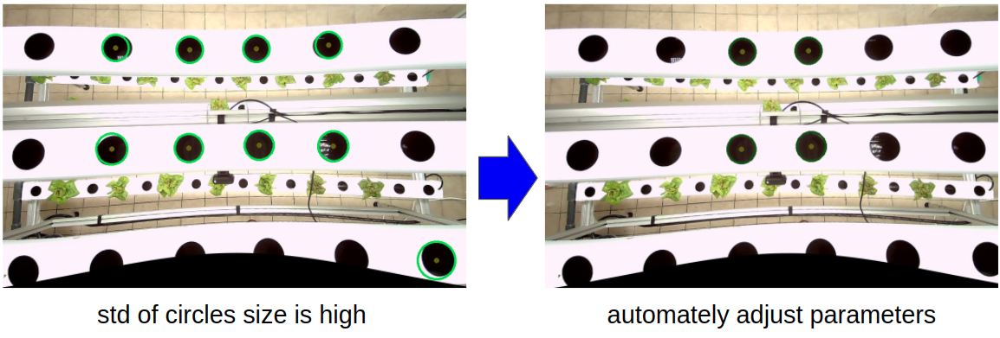
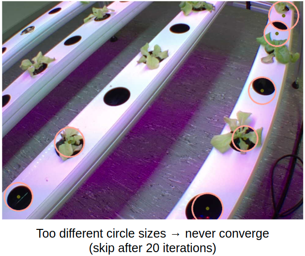

# Compute the dimension of pixel

```
python compute_area.py --input {image directory} --meta {location of meta data (or save directory)}
```

## Current version supports only if there are circles of the same size in images.

Hough transformation algorithm searches for known size of circles. `ACTUAL_DIM` (diameter of circle, unit: cm)

<div align="left">
    
    <figcaption align = "left"><b>Fig.1 - Fitting circles </b></figcaption>
</div>
<br />

In case no appropriate representative circles, the image is skipped.

<div align="left">
    
    <figcaption align = "left"><b>Fig.2 - Fail case </b></figcaption>
</div>
<br />